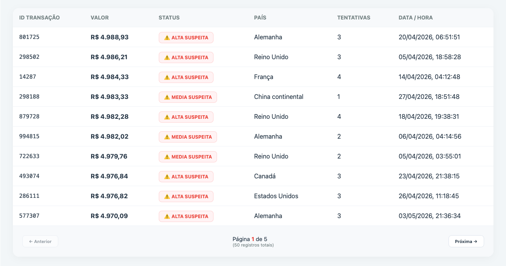
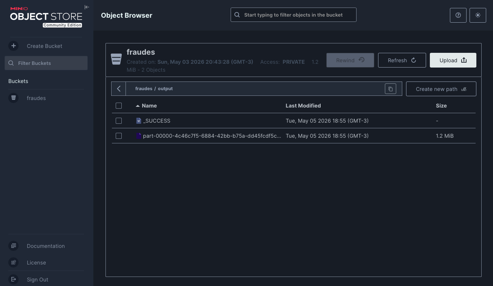

# Sistema de Detecção de Fraudes com Big Data

Projeto acadêmico desenvolvido no contexto da pós-graduação em Engenharia de Software da Universidade Federal do Rio de Janeiro (UFRJ). A aplicação simula um pipeline de Big Data para geração, processamento, armazenamento e visualização de transações financeiras suspeitas.

O sistema combina Apache Spark, MinIO compatível com S3, FastAPI e Angular para demonstrar uma arquitetura desacoplada entre processamento, armazenamento, exposição de dados e interface analítica.

## Arquitetura

```text
Apache Spark (ETL)
        |
        v
MinIO Object Storage (S3A)
        |
        v
FastAPI
        |
        v
Angular + Chart.js
```

### Componentes

- `spark/`: aplicação PySpark responsável por gerar 1.000.000 de transações simuladas, aplicar regras de fraude e gravar os resultados no MinIO via protocolo `s3a://`.
- `backend/`: API FastAPI que lê os arquivos JSON armazenados no bucket `fraudes` do MinIO e expõe os maiores riscos no endpoint `/fraudes/top`.
- `frontend/`: dashboard Angular que consome a API, exibe indicadores, gráfico das maiores fraudes e tabela paginada.
- `docker-compose.yml`: orquestra MinIO, API e job Spark em containers.

## Pipeline de Dados

1. O Spark gera transações sintéticas com valor, país, dispositivo, horário, tentativas e data/hora.
2. As regras de negócio classificam cada transação como `ALTA_SUSPEITA`, `MEDIA_SUSPEITA` ou `NORMAL`.
3. Transações suspeitas são ordenadas por valor e gravadas em `s3a://fraudes/output`.
4. A API lê os objetos JSON do bucket `fraudes` no MinIO.
5. O frontend consulta a API e renderiza os dados em cards, gráfico e tabela.

## Regras de Fraude

- `ALTA_SUSPEITA`: valor acima de R$ 2.000, país diferente de `BR` e pelo menos 3 tentativas.
- `MEDIA_SUSPEITA`: valor acima de R$ 800, horário entre 00h e 06h e pelo menos 1 tentativa.
- `NORMAL`: transações que não se enquadram nos critérios de risco.

## Tecnologias

- Apache Spark 3.5.0
- PySpark
- MinIO
- FastAPI
- Uvicorn
- Angular 21
- Chart.js
- Docker e Docker Compose

## Estrutura do Projeto

```text
.
├── backend/
│   ├── api.py
│   ├── Dockerfile
│   └── requirements.txt
├── frontend/
│   ├── public/
│   ├── src/
│   ├── angular.json
│   ├── package.json
│   └── package-lock.json
├── spark/
│   ├── app_spark.py
│   ├── Dockerfile
│   └── requirements.txt
├── docker-compose.yml
└── README.md
```

## Como Executar

### 1. Subir infraestrutura, API e processamento

Na raiz do projeto:

```bash
docker compose up --build
```

Esse comando inicia:

- MinIO em `http://localhost:9001`
- API FastAPI em `http://localhost:8000`
- Job Spark que gera e grava os dados no bucket `fraudes`

Credenciais padrão do MinIO:

```text
Usuário: admin
Senha: admin123
```

### 2. Validar a API

Depois que o processamento Spark finalizar, acesse:

```text
http://localhost:8000/fraudes/top
```

O endpoint retorna as 50 transações suspeitas de maior valor.

### 3. Executar o frontend

Em outro terminal:

```bash
cd frontend
npm install
npm start
```

Acesse:

```text
http://localhost:4200
```

## Execução Manual do Spark

Também é possível executar o processamento Spark diretamente, desde que o MinIO esteja disponível:

```bash
cd spark
pip install -r requirements.txt
python app_spark.py
```

Em execução local fora do Docker, ajuste o endpoint S3A em `spark/app_spark.py` caso necessário, pois o código usa `http://minio:9000`, nome resolvido pela rede do Docker Compose.

## Execução Manual da API

```bash
cd backend
pip install -r requirements.txt
uvicorn api:app --host 0.0.0.0 --port 8000
```

Variáveis de ambiente suportadas:

```text
MINIO_ENDPOINT=localhost:9000
MINIO_ACCESS_KEY=admin
MINIO_SECRET_KEY=admin123
```

## Evidências Visuais






## Observações

- O projeto usa MinIO para simular um Data Lake compatível com S3.
- A arquitetura separa processamento e armazenamento, permitindo evolução para serviços como AWS S3, EMR ou Databricks.
- O frontend espera que a API esteja disponível em `http://localhost:8000`.
- Os dados gerados pelo Spark são descartáveis e não devem ser versionados no Git.
